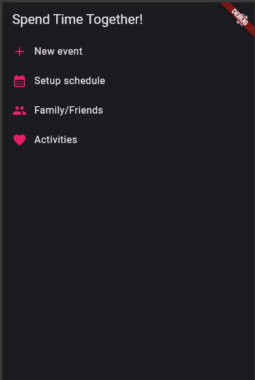
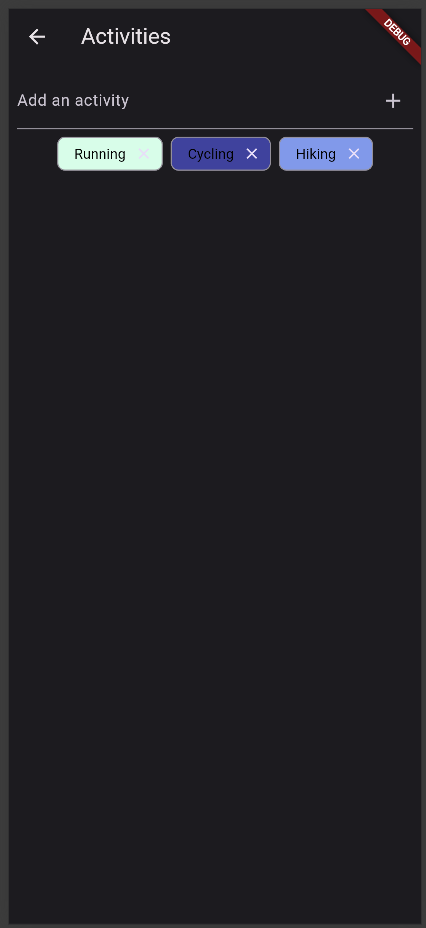
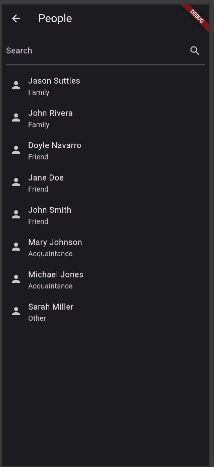

# Spend Time Together! App

... I let this app languish for a few months and now it won't compile. Looking for an alternative to flutter now...

Activities Page

People Page

This app is being built to facilitate friends and family spending more time together.

People have time that they are available to the people they are close to.

Maybe, you've got family, friends, and acquaintances. You'll have a more open schedule for your family, a little less open schedule for friends but still pretty open, and a very limited schedule for acquaintances.

You can list out the types of things that you're interested in doing with certain types of people. Maybe you're open to doing something specific with someone. This app will facilitate giving people the opportunity to list out what they are open to doing together.

Then, when you've got your schedule, your list of activities, and your family/friends/acquaintances, then you're ready to create new events that invite your family/friends/acquaintances to things that you all mutually want to do.
